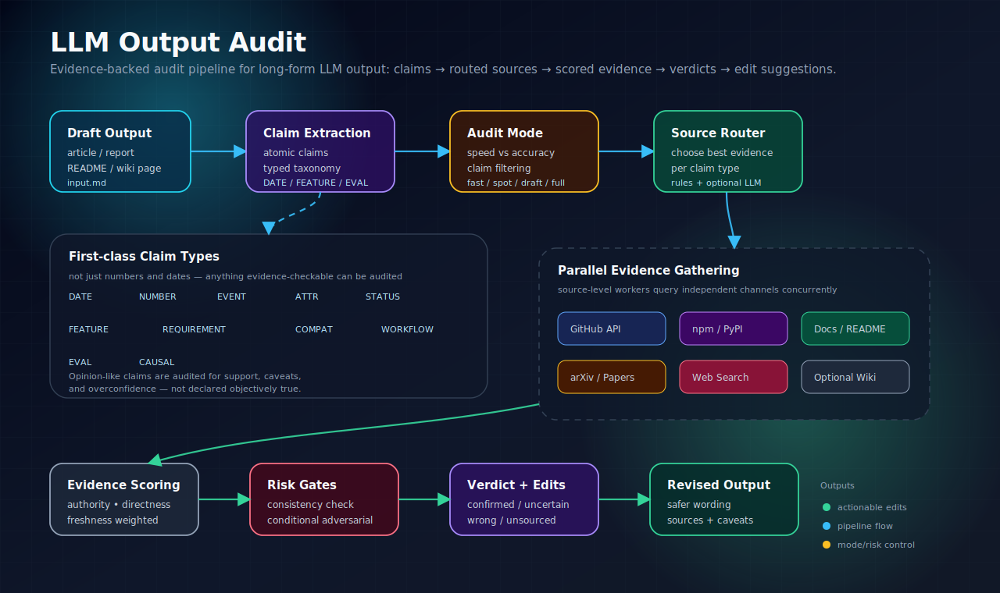

# LLM Output Audit

[English](README.md) | [简体中文](README.zh-CN.md)

[](https://github.com/Kinneyzhang/llm-output-audit/actions/workflows/ci.yml)

> Cross-agent LLM output auditing: factual accuracy, hallucination risk, stale knowledge, internal contradictions, source quality, and actionable edit suggestions.

LLM Output Audit is a portable audit toolkit for reviewing AI-generated research reports, technical comparisons, usage guides, deployment writeups, README/blog drafts, and other durable long-form content before you save, publish, or reuse it. It ships as a Python CLI, a stdio MCP server, and lightweight adapters for Hermes, Claude Code, Codex, OpenCode, Gemini, and generic coding agents.

It is not just another RAG workflow. RAG retrieves context to help generate an answer. LLM Output Audit starts with an existing draft, extracts atomic factual claims, routes each claim to the most authoritative evidence source, verifies the evidence, rates the claim, and produces concrete edit suggestions.

## Architecture



The pipeline separates drafting from auditing: text is converted into typed claims, claims are filtered by audit mode, the Source Router chooses evidence channels, evidence is gathered in parallel, and the final report produces verdicts plus edit suggestions.

## Demo report

See [examples/demo-report.md](examples/demo-report.md) for an illustrative audit report showing verdict sections, routed sources, source quality, and edit suggestions.

## Why this exists

LLMs are good at drafting, but long-form AI output tends to fail in predictable ways:

- **Hallucinated facts** — confident but wrong dates, numbers, names, attributions, or causal claims.
- **Stale knowledge** — project status, version numbers, download counts, or ecosystem facts that changed after the model learned them.
- **Unsupported claims** — plausible claims with no reliable evidence.
- **Internal contradictions** — sections that cannot all be true at the same time.
- **Weak source quality** — generic snippets used where official APIs or primary sources should be used.

LLM Output Audit gives humans and agents a repeatable review pipeline before output becomes part of your notes, wiki, blog, README, or public documentation.

## What it does

```text
Draft article
  ↓
Extract atomic factual claims
  ↓
Select audit mode: fast / spot / draft / full / auto
  ↓
Route each selected claim to the best evidence sources
  ↓
Query sources in parallel
  ↓
Score evidence by authority, directness, and freshness
  ↓
Fetch generic web pages when useful
  ↓
Rate each claim
  ↓
Run conditional adversarial review for risky wrong claims
  ↓
Generate an audit report with edit suggestions
```

## Key features

- **Claim extraction** — turns prose into individually verifiable `[DATE]`, `[NUMBER]`, `[EVENT]`, `[ATTR]`, `[STATUS]`, and `[CAUSAL]` claims.
- **Source Router** — routes different claims to the right evidence channel instead of blindly searching the web.
- **Specialized sources** — GitHub, Wikipedia, arXiv, Semantic Scholar, PyPI, npm, Tavily/DuckDuckGo, and optional local LLM Wiki.
- **Evidence scoring** — ranks evidence by authority, directness, freshness, and whether it came from structured API data.
- **Audit modes** — choose between fast, spot, draft, full, or auto depth to balance speed and accuracy.
- **Parallel verification** — claim-level and source-level concurrency with configurable worker counts.
- **Risk-gated consistency checking** — detects when internal contradiction checks are worth running.
- **Conditional adversarial pass** — reduces false positives for claims initially marked wrong.
- **Actionable edits** — generates correction, hedging, citation, or deletion suggestions instead of only saying “right/wrong”.
- **Optional local knowledge base** — LLM Wiki can be used when available, but is not required.
- **Multi-agent packaging** — install lightweight adapters for Hermes, Claude Code, Codex, OpenCode, Gemini, or generic agents without duplicating the core CLI.
- **MCP server** — expose `audit_file`, `audit_text`, and `summarize_trace` as stdio MCP tools for MCP-compatible agents.

## Audit modes

LLM Output Audit does not run the same expensive pipeline for every task. Use modes to balance latency and reliability.

| Mode | Best for | Behavior |
| --- | --- | --- |
| `fast` | Ordinary low-risk chat | No full audit. Use normal answering or manual spot-check only when needed. |
| `spot` | High-risk short factual answers | Audit up to 3 highest-importance claims, 1–2 routed sources each, no consistency/adversarial pass. |
| `draft` | Durable drafts, internal reports, notes, wiki pages | Audit up to 12 medium/high-importance claims, risk-gated consistency, conditional adversarial pass. |
| `full` | Public publishing, important reports, user-requested deep audit | Audit up to 50 claims, more sources, full consistency check, LLM router, adversarial pass enabled. |
| `auto` | Default scripted use | Infer mode from claim count, article length, and consistency risk. |

Recommended defaults:

- Ordinary short answer: `fast`
- High-risk short factual answer: `spot`
- Research report / usage guide / technical comparison: `draft`
- Blog post / README / public docs / important report: `full`

## What kinds of claims can it audit?

The implementation now uses an explicit claim taxonomy — `[DATE]`, `[NUMBER]`, `[EVENT]`, `[ATTR]`, `[STATUS]`, `[FEATURE]`, `[REQUIREMENT]`, `[COMPAT]`, `[WORKFLOW]`, `[EVAL]`, and `[CAUSAL]` — so feature, requirement, compatibility, workflow, and evaluative claims are first-class audit targets.

LLM Output Audit can audit many information claims as long as they can be tied to evidence:

| Claim class | Example | How it is handled |
| --- | --- | --- |
| Numeric / date claims | “Package X has 1M weekly downloads”, “Project Y was released in 2025” | Routed to package registries, GitHub releases, web announcements, etc. |
| Feature / capability claims | “Library X supports streaming responses”, “Tool Y can index local Markdown files” | Routed to official docs, README, source code, issues, package docs, or project website. Represented as `[FEATURE]`. |
| Requirement / constraint claims | “This package requires Python 3.10+”, “The service needs PostgreSQL” | Routed to package metadata, installation docs, README, pyproject/package.json, or deployment docs. Represented as `[REQUIREMENT]`. |
| Support / compatibility claims | “Framework X supports Vite”, “Model Y works with OpenAI-compatible APIs” | Routed to official docs, changelog, examples, integration docs, or source code. Represented as `[COMPAT]`. |
| Process / workflow claims | “The tool first extracts claims and then routes evidence sources” | Routed to this repository’s source code, documentation, or examples. Represented as `[WORKFLOW]`. |
| Comparative claims | “A is faster/more reliable than B” | Routed to benchmarks, papers, docs, or independent evaluations. Often rated `⚠️ UNCERTAIN` unless the evidence is strong. Represented as `[EVAL]` or `[CAUSAL]`. |
| Opinion-like claims | “This is the best option for most teams” | Not treated as objectively true/false. The audit checks whether the claim is supported, overconfident, missing caveats, or should be rewritten as an opinion. |

So the tool is not limited to numbers and dates. The important boundary is **verifiability**: if a claim can be checked against documentation, metadata, source code, benchmarks, papers, or reliable commentary, it can be audited. If it is purely subjective, the tool can still flag overconfidence and suggest more careful wording, but it cannot prove the opinion “true”.

## Source Router

Different facts have different authoritative sources. LLM Output Audit asks the source that owns the fact.

| Claim type | Preferred evidence |
| --- | --- |
| GitHub stars, releases, project activity | GitHub API |
| npm package version or downloads | npm registry / npm downloads API |
| Python package version or release date | PyPI API |
| Package features or capabilities | Official docs, README, source code, examples, issue discussions |
| Runtime requirements or installation constraints | `pyproject.toml`, `package.json`, package metadata, installation docs |
| API compatibility or integration support | Official docs, changelog, examples, source code, release notes |
| Paper metadata, publication date | arXiv API |
| Paper citations, venue, authors | Semantic Scholar API |
| Organization, person, historical background | Wikipedia / primary web sources |
| Current announcements, ecosystem news | Tavily / DuckDuckGo web search |
| Comparative or evaluative claims | Benchmarks, papers, official docs, independent evaluations |
| User-curated local knowledge | Optional LLM Wiki |

Example:

```text
Claim: Next.js has over 150 million monthly npm downloads
Routes: npm → Tavily web
```

```text
Claim: github.com/assafelovic/gpt-researcher is an open-source project
Routes: GitHub → Tavily web
```

## Ratings

Each audited claim receives one rating:

| Rating | Meaning | Typical action |
| --- | --- | --- |
| ✅ `CONFIRMED` | Official source or multiple reliable sources support the claim. | Keep. |
| 🟡 `LIKELY` | One reliable source supports it and no contradiction is found. | Keep, preferably add citation. |
| ⚠️ `UNCERTAIN` | Sources conflict, the source is weak, or the claim is too broad. | Hedge, cite, or request human review. |
| ❌ `WRONG` | Reliable evidence clearly contradicts the claim. | Replace with corrected text. |
| 🔍 `UNSOURCED` | No relevant evidence found either way. | Remove, hedge, or mark citation needed. |

## Installation

Clone the repository:

```bash
git clone https://github.com/Kinneyzhang/llm-output-audit.git
cd llm-output-audit
```

Install Python dependencies:

```bash
python3 -m pip install -r requirements.txt
```

The script is intentionally small: it uses the Python standard library for orchestration and `requests` for HTTP calls.

### Install into an agent

The canonical implementation stays in this repository. `scripts/install_agent_skill.py` installs small adapter files so different agents can discover and run the same CLI.

Preview what would be installed:

```bash
python3 scripts/install_agent_skill.py --agent hermes --scope user --dry-run
python3 scripts/install_agent_skill.py --agent claude-code --scope user --dry-run
python3 scripts/install_agent_skill.py --agent codex --scope project --dry-run
python3 scripts/install_agent_skill.py --agent mcp --scope project --dry-run
```

Install examples:

```bash
# Hermes: symlink the repository into the Hermes skill directory
python3 scripts/install_agent_skill.py --agent hermes --scope user

# Claude Code: create a Claude skill file and a marker-managed CLAUDE.md block
python3 scripts/install_agent_skill.py --agent claude-code --scope user

# Codex / generic coding agents: append a marker-managed AGENTS.md block
python3 scripts/install_agent_skill.py --agent codex --scope project
```

Supported adapters: `hermes`, `claude-code`, `codex`, `opencode`, `gemini`, `generic`, and `mcp`.

Safety behavior:

- Existing `AGENTS.md` and `CLAUDE.md` files are updated only inside a marker block: `<!-- llm-output-audit:start --> ... <!-- llm-output-audit:end -->`.
- Hermes defaults to a symlink so there is one physical source of truth.
- Use `--target PATH` for custom locations, `--mode copy` when symlinks are not suitable, and `--force` only when you intentionally want to replace a non-marker-managed target.

## MCP server

Run the stdio MCP server directly:

```bash
python3 scripts/mcp_server.py
```

It exposes four tools:

- `audit_file` — audit a local Markdown/text file and write an audit report plus trace log.
- `audit_text` — audit text supplied by the MCP client by first writing it to a temporary Markdown file.
- `summarize_trace` — summarize a JSONL trace log so another agent can inspect the audit process.
- `install_snippet` — return MCP client configuration snippets for this server.

Hermes MCP config example:

```yaml
mcp_servers:
  llm-output-audit:
    command: "python3"
    args: ["/path/to/llm-output-audit/scripts/mcp_server.py"]
    timeout: 600
    connect_timeout: 30
```

Claude Code example:

```bash
claude mcp add llm-output-audit -- python3 /path/to/llm-output-audit/scripts/mcp_server.py
```

Generate a config snippet file:

```bash
python3 scripts/install_agent_skill.py --agent mcp --scope project
```

## Configuration

At least one OpenAI-compatible LLM key is required for claim extraction and rating.

### Required

Use one of:

```bash
export DEEPSEEK_API_KEY="..."
```

or:

```bash
export OPENAI_API_KEY="..."
```

### Recommended

Tavily can improve general web evidence quality:

```bash
export TAVILY_API_KEY="..."
```

Without Tavily, the script falls back to DuckDuckGo’s instant-answer API where possible.

### Optional OpenAI-compatible endpoint

For local or self-hosted models:

```bash
export FACT_CHECK_BASE_URL="http://localhost:8000/v1"
export FACT_CHECK_MODEL="your-model-name"
export DGX_API_KEY="..."   # if your endpoint requires a key
```

### Optional LLM Wiki

LLM Wiki is optional. The audit works without it.

```bash
--use-wiki --wiki /path/to/llm-wiki
```

## Usage

### Spot-check a short high-risk factual answer

```bash
python3 scripts/fact_check.py \
  --file article.md \
  --mode spot \
  --workers 3 \
  --source-workers 3
```

### Audit a durable draft

```bash
python3 scripts/fact_check.py \
  --file article.md \
  --output article-audit.md \
  --mode draft \
  --workers 6 \
  --source-workers 4
```

### Publication-grade audit

```bash
python3 scripts/fact_check.py \
  --file article.md \
  --output article-audit.md \
  --mode full \
  --workers 8 \
  --source-workers 4
```

### Use local LLM Wiki as an extra evidence source

```bash
python3 scripts/fact_check.py \
  --file article.md \
  --output article-audit.md \
  --mode draft \
  --use-wiki \
  --wiki /path/to/llm-wiki
```

### Extract claims only

```bash
python3 scripts/fact_check.py \
  --file article.md \
  --dry-run
```

### Write a detailed execution trace

Use `--trace-log` when debugging the auditor itself. It writes JSONL events for claim extraction, mode selection, source routing, concrete source queries, structured API results, evidence ranking, deterministic overrides, and final ratings.

```bash
python3 scripts/fact_check.py \
  --file article.md \
  --output article-audit.md \
  --mode full \
  --trace-log article-audit-trace.jsonl
```

This is especially useful when checking whether a claim such as `GitHub Stars` was resolved through GitHub API metadata or polluted by generic web-search snippets. Secrets are redacted from trace events.

## CLI reference

```text
--file FILE                    Markdown article to audit. Required.
--output OUTPUT                Report path. Default: <file>-audit.md.
--mode auto|fast|spot|draft|full
                               Speed/depth policy. Default: auto.
--workers N                    Parallel claim verification workers.
--source-workers N             Parallel evidence-source workers per claim.
--wiki PATH                    Optional LLM Wiki root; only used with --use-wiki.
--use-wiki                     Enable optional local LLM Wiki evidence source.
--skip-consistency             Skip internal consistency check.
--force-consistency            Force internal consistency check.
--dry-run                      Extract claims only.
--no-fetch                     Skip source page fetching.
--llm-router                   Use LLM to refine source routing when ambiguous.
--trace-log PATH               Write detailed JSONL execution trace for debugging.
```

## Example output

The following is an illustrative report excerpt showing the output shape. The concrete claims and verdicts are examples, not benchmark claims about this project.

```markdown
# LLM Output Audit Report: article.md
Checked: 2026-05-10
Claims audited: 3 / 4 extracted
Audit mode: spot
Verdict summary: ✅ CONFIRMED 2 | 🔍 UNSOURCED 1

---

## ✅ Confirmed

- **[STATUS]** github.com/assafelovic/gpt-researcher is an open-source project
  - Routed sources: github, tavily_web
  - Source quality: score=0.912 structured=True
  - Evidence: The GitHub repository is licensed under Apache-2.0 and publicly accessible.
  - Source: https://github.com/assafelovic/gpt-researcher

## 🔍 Unsourced — Could Not Verify

- **[NUMBER]** A package has a specific monthly npm download count
  - Routed sources: npm, tavily_web
  - Source quality: score=0.812 structured=True
  - Evidence: npm metadata confirms the package identity, but the exact monthly count requires a reliable download-statistics source.
  - Suggestion: Add a reliable download statistics citation or hedge the number.
```

## Agent workflow policy

The toolkit is designed for agentic use, not only manual CLI use.

### Agent-generated durable output

When an agent generates content that will be saved, published, or reused:

```text
Draft internally → run audit → apply safe revisions → deliver/save final version
```

Do not show the user an unreviewed draft as the final answer.

### User-supplied existing text

When the user provides an existing article or file:

```text
Audit first → return report + prioritized edit suggestions → wait before modifying source
```

Do not silently mutate user-owned source files unless the user explicitly asks to apply fixes.

### High-risk short answers

For short answers involving current versions, project status, prices, release dates, legal/medical/financial/security facts:

```text
High-risk claim → source route → quick spot-check → answer with uncertainty/citation
```

## Performance and parallelism

Use parallelism to reduce latency:

- `--workers` controls claim-level concurrency.
- `--source-workers` controls source-level concurrency inside each claim.
- Structured API evidence skips unnecessary web-page fetching.
- Consistency checks, adversarial review, and LLM routing are mode/risk gated.

Recommended starting point:

```bash
--workers 6 --source-workers 4
```

Reduce workers if an API rate-limits you. Increase carefully when using local endpoints or generous provider quotas.

## Continuous Integration

This repository uses GitHub Actions to run a lightweight CI workflow on every push and pull request. The CI does not call paid LLM APIs. It verifies the parts that should always work without credentials:

- Python syntax: `python -m py_compile scripts/fact_check.py`
- CLI startup: `python scripts/fact_check.py --help`
- Source Router import and smoke tests for `FEATURE`, `REQUIREMENT`, `COMPAT`, `WORKFLOW`, and `EVAL`
- Required docs and examples exist
- README language switch links are present
- Architecture SVG is valid enough to be detected by a basic sanity check

Why CI matters here:

- It prevents accidental syntax breaks in the CLI.
- It catches missing docs/assets after refactors.
- It lets outside contributors submit PRs without guessing whether the repo still works.
- It keeps the public release trustworthy without requiring secrets in GitHub Actions.

## Limitations

LLM Output Audit improves reliability, but it does not guarantee truth.

Known limitations:

- Search indexes can lag recent events.
- Niche or private facts may be unsourced.
- Some third-party web pages contain inaccurate or stale information.
- Causal and qualitative claims still require human judgment.
- A `🔍 UNSOURCED` rating means “not verified”, not automatically “false”.
- A `❌ WRONG` rating should still be checked before high-stakes publication.

## Project structure

```text
.
├── README.md
├── SKILL.md
├── LICENSE
├── requirements.txt
├── scripts/
│   └── fact_check.py
└── examples/
    └── smoke.md
```

## Roadmap

Potential next steps:

- Cache source results under `~/.cache/llm-output-audit/`.
- Add deterministic numeric/date/version comparison before LLM rating.
- Add structured claim normalization (`subject`, `predicate`, `claimed_value`, `time_window`).
- Add optional `--apply` mode for safe automatic patching of clear `❌ WRONG` fixes.
- Add GitHub Actions smoke tests.
- Package as a Python CLI (`pipx install llm-output-audit`).

## Contributing

Issues and pull requests are welcome. Good contributions include:

- New source adapters.
- Better claim extraction prompts.
- More robust entity/package detection.
- Evaluation examples and benchmarks.
- Safer edit-application logic.

## License

MIT
